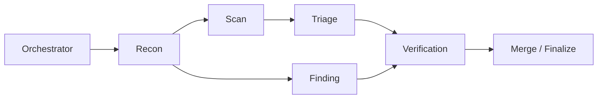

<div align="center">

# AutoCVE — Tự động tìm CVE, kiểm tra mã nguồn, xác minh lỗ hổng và lập báo cáo


[](https://www.gnu.org/licenses/agpl-3.0)
[](https://www.python.org/)
[](https://fastapi.tiangolo.com/)
[](https://react.dev/)
[](https://www.postgresql.org/)

<p align="center"></p>

[📚 Tài liệu](#-tài-liệu) · [✨ Tính năng](#-tính-năng-chính) · [🚀 Bắt đầu](#-bắt-đầu-nhanh) · [🏆 Kết quả](#-kết-quả-cve)

**Tiếng Việt** | [English](./README_EN.md) | [简体中文](./README_ZH.md)

</div>

---

## 📚 Tài liệu

- **[Hướng dẫn sử dụng (tiếng Anh)](./docs/USER_GUIDE_EN.md)** / [bản tiếng Trung](./docs/USER_GUIDE.md): triển khai, cấu hình mô hình, nhập dự án, kiểm tra mã nguồn, One-click CVE, quản lý lỗ hổng và Skills.
- **[Thiết kế kiến trúc (tiếng Anh)](./docs/ARCHITECTURE_DESIGN_EN.md)** / [bản tiếng Trung](./docs/ARCHITECTURE_DESIGN.md): Multi-Agent, điều phối công cụ và Finding Runtime.
- **[Tài liệu API (tiếng Anh)](./docs/API_DOCUMENTATION_EN.md)** / [bản tiếng Trung](./docs/API_DOCUMENTATION.md): endpoint, cấu trúc dữ liệu và cách gọi API.

> Giao diện phiên bản mã nguồn đã Việt hóa ưu tiên tiếng Việt và vẫn hỗ trợ tiếng Anh/tiếng Trung. Các tài liệu chuyên sâu ở liên kết trên hiện chưa được Việt hóa. Image Docker phát hành bởi upstream có thể chưa chứa các thay đổi trên nhánh này.

---

## ✨ Tính năng chính

### 🚀 Quy trình hỗ trợ tìm CVE

AutoCVE tích hợp các bước tìm dự án tiềm năng, nhập repository, tạo nhiệm vụ kiểm tra, phân tích mã nguồn bằng Agent, xác minh phát hiện và sinh báo cáo. Kết quả do AI tạo ra phải được người nghiên cứu đánh giá lại trước khi công bố; việc cấp CVE phụ thuộc cơ quan tiếp nhận.

### 🤖 Kiểm tra bảo mật bằng Multi-Agent

Orchestrator điều phối Recon, Scan, Triage, Finding và Verification để khảo sát mã nguồn, quét, lọc cảnh báo, truy vết đường khai thác và xác minh động khi được cấu hình.



### 🧩 Ba chế độ kiểm tra

| Chế độ | Agent trọng tâm | Phù hợp |
| --- | --- | --- |
| **Quét tăng cường** (Enhanced Scan) | Scan → Triage | Phân loại kết quả quét và giảm cảnh báo sai |
| **Kiểm tra thông minh** (Intelligent Audit) | Finding | Tìm lỗ hổng giá trị cao bằng phân tích mã nguồn |
| **Kiểm tra tổng hợp** (Comprehensive Audit) | Scan → Triage + Finding | Kết hợp quét công cụ và phân tích sâu |

Finding Agent dùng ReAct Loop, công cụ đọc/truy vết mã, các thông điệp điều chỉnh luồng và `FinalizeFinding` để chốt kết quả có cấu trúc. Giao diện hỗ trợ theo dõi tiến trình, cây Agent, tool call, phiên kiểm tra và tình trạng lỗ hổng; có thể cài Skills mở rộng năng lực cho từng Agent.

---

## 🚀 Bắt đầu nhanh

### Dựng từ mã nguồn (đúng với bản Việt hóa local)

Cần cài Docker Engine và Docker Compose v2. Tại thư mục source AutoCVE hiện có:

```bash
docker compose up -d --build
```

Nếu chưa có repository, bạn có thể tải bản **upstream gốc**:

```bash
git clone https://github.com/larlarua/AutoCVE.git
cd AutoCVE
docker compose up -d --build
```

**Lưu ý:** lệnh clone này tải upstream, không tự mang theo các thay đổi Việt hóa chưa được tích hợp. Muốn sử dụng bản đã sửa trong project hiện tại, hãy build chính thư mục mã nguồn đã Việt hóa.

### Cài bằng image upstream (không bao gồm bảo đảm về tiếng Việt)

```bash
curl -fsSL https://raw.githubusercontent.com/larlarua/AutoCVE/v1.0.5/docker-compose.prod.yml -o docker-compose.upstream.yml
docker compose -f docker-compose.upstream.yml up -d
```

Cấu hình trên lấy image release `v1.0.5` từ upstream. Kiểm tra kỹ file Compose trước khi dùng; không sử dụng cách này để thử những thay đổi chỉ có trong source local.

### Địa chỉ truy cập khi chạy Compose local

| Dịch vụ | Địa chỉ | Chức năng |
| --- | --- | --- |
| Frontend | http://localhost:3000 | Giao diện AutoCVE |
| Backend API | http://localhost:8000 | API |
| Swagger | http://localhost:8000/docs | Khám phá và thử API |
| Adminer | http://localhost:8080 | Quản trị cơ sở dữ liệu (Compose local) |

Để truy cập từ máy khác trong mạng, thay `localhost` bằng IP hoặc hostname máy chủ và cấu hình firewall phù hợp.

### Yêu cầu môi trường

Đối với bản chạy Docker, cấu hình **khuyến nghị tham khảo** từ [hướng dẫn upstream](./docs/USER_GUIDE_EN.md):

| Thành phần | Khuyến nghị |
| --- | --- |
| CPU | Từ 4 vCPU |
| RAM | Từ 8 GB (dự án lớn cần thêm tài nguyên) |
| Dung lượng trống | Từ 20 GB, tùy image Docker và mã nguồn cần kiểm tra |
| Docker Engine | 20.10 trở lên |
| Docker Compose | Plugin v2, ưu tiên 2.24 trở lên |
| Mạng | Kết nối đến dịch vụ LLM và kho Git nếu cần import repository |

Compose local chạy PostgreSQL 15, Redis 7, backend FastAPI, các worker Agent/One-click CVE, frontend Nginx và image sandbox. Quyền dùng Docker daemon là cần thiết nếu bật sandbox để kiểm tra lỗ hổng. Không chạy công cụ trên server chứa dữ liệu nhạy cảm khi chưa đánh giá rủi ro của việc mount Docker socket.

### Cấu hình lần đầu (LLM và bảo mật)

Tạo file cấu hình tại máy chạy Docker, trong thư mục source:

```bash
# Chạy ở thư mục gốc repository; không ghi đè .env đã có
test -f backend/.env || cp backend/env.example backend/.env
```

Trên PowerShell, có thể dùng `Copy-Item backend/env.example backend/.env` nếu chưa có file. Mở `backend/.env` và cập nhật tối thiểu:

```dotenv
SECRET_KEY=<chuoi-bi-mat-ngau-nhien-du-dai>
LLM_PROVIDER=openai
LLM_API_KEY=<api-key-cua-ban>
LLM_MODEL=<ten-model-ho-tro-tool-calling>
# Chỉ đặt khi sử dụng endpoint khác mặc định của provider
LLM_BASE_URL=
```

- Sinh `SECRET_KEY` ngẫu nhiên cho môi trường thực tế (ví dụ dùng lệnh `openssl rand -hex 32`); không sử dụng giá trị mẫu của `env.example`.
- Không commit `backend/.env` hoặc công khai API key. Các giá trị `<...>` trong ví dụ là placeholder, **không dùng nguyên mẫu**.
- Compose local đọc `backend/.env` cho backend/worker và ghi đè các địa chỉ nội bộ DB/Redis; không cần chỉnh `DATABASE_URL` hay `REDIS_URL` trong Compose chỉ để kết nối mặc định.
- Cấu hình PostgreSQL trong `docker-compose.yml` vẫn dùng tài khoản/mật khẩu phát triển mặc định và ánh xạ cổng `5432`/`6379`. Nếu đưa lên mạng thật, phải giới hạn truy cập, thay thông tin đăng nhập và rà soát cấu hình triển khai trước.

Sau khi chỉnh cấu hình, chạy `docker compose up -d --build` (hoặc `docker compose up -d` khi không cần build lại image) và đăng nhập web. Vào **Cài đặt hệ thống → Cấu hình mô hình** (`/admin`) để kiểm tra provider, model, API key, Base URL và **kiểm tra kết nối**. Một số Agent có thể được cấu hình model riêng; nếu chưa cấu hình riêng, chúng dùng cấu hình toàn cục.

**Lưu ý giao thức:** nếu dùng proxy/relay LLM, chọn endpoint protocol tương thích với API mà proxy cung cấp (OpenAI-compatible, Anthropic hoặc Google), không chỉ chọn theo tên model. Có trường hợp chat văn bản hoạt động nhưng Agent không gọi được tool nếu cấu hình protocol không khớp.

### Đăng nhập và quy trình sử dụng

Với khởi tạo mặc định của project, ứng dụng tạo tài khoản demo `demo@example.com` / `demo123` có quyền quản trị để thử nghiệm. **Không công khai dịch vụ với thông tin đăng nhập mặc định**; đổi mật khẩu hoặc vô hiệu hóa tài khoản demo trước khi triển khai thực tế.

1. Truy cập **Quản lý dự án** (`/projects`), tạo dự án từ GitHub/GitLab/Gitea hoặc upload ZIP mã nguồn. Nếu cần truy cập repository riêng tư, cấu hình thông tin xác thực phù hợp.
2. Trong **Nhiệm vụ kiểm tra** (`/audit-tasks`) hoặc màn hình chi tiết dự án, tạo nhiệm vụ và chọn chế độ quét tăng cường, kiểm tra thông minh hoặc kiểm tra tổng hợp.
3. Theo dõi tiến trình Agent, công cụ được gọi và sự kiện từ màn hình nhiệm vụ/phiên kiểm tra. **Orchestrator** và **Recon** luôn tham gia; các Agent khác phụ thuộc lựa chọn workflow.
4. Mở **Quản lý lỗ hổng** (`/vulnerabilities`) để xem Finding đã được ghi nhận, kiểm tra đường dẫn mã nguồn, bằng chứng source → sink, PoC, mức độ ảnh hưởng và trạng thái xác minh.
5. Rà soát báo cáo và xuất báo cáo từ chức năng tương ứng khi khả dụng. Không gửi báo cáo cho bên thứ ba trước khi xác minh độc lập nội dung AI tạo ra.

Tính năng **One-click CVE** (`/one-click-cve`) tự tìm các repository ứng viên và điều phối audit; tính năng này cần truy cập GitHub, LLM và các worker hoạt động. **Skills** (`/skills`) hỗ trợ tải/quản lý kỹ năng theo nhu cầu. Chi tiết cấu hình và hình ảnh xem trong [hướng dẫn sử dụng upstream bằng tiếng Anh](./docs/USER_GUIDE_EN.md).

### Kiểm tra trạng thái, nhật ký và dừng dịch vụ

Các lệnh dưới đây áp dụng khi chạy với file `docker-compose.yml` tại thư mục gốc:

```bash
docker compose ps
docker compose logs --tail=100 backend agent-worker one-click-cve-worker frontend
curl -f http://localhost:8000/health

# Tạo lại các container dùng backend/.env để nhận cấu hình mới
docker compose up -d --force-recreate backend agent-worker one-click-cve-worker

# Dừng và gỡ container, giữ lại các volume dữ liệu
docker compose down
```

**Không thêm `-v` vào `docker compose down`** nếu muốn giữ PostgreSQL/Redis/upload volumes. Sao lưu dữ liệu trước khi nâng cấp hoặc thay đổi cấu hình lưu trữ.

### Xử lý lỗi thường gặp

| Triệu chứng | Cách kiểm tra |
| --- | --- |
| Không mở được web tại `:3000` | Xem `docker compose ps` và `docker compose logs --tail=100 frontend backend`; kiểm tra firewall/cổng đang dùng |
| API lỗi, web liên tục loading | Kiểm tra `http://localhost:8000/health` và log `backend`, `db`, `redis`; xác nhận migration thành công |
| Test LLM lỗi xác thực | Kiểm tra API key, provider, tên model, Base URL và quyền truy cập mạng; không dùng key mẫu |
| Agent trả văn bản nhưng không thực thi tool hoặc không ghi Finding | Kiểm tra endpoint protocol, hỗ trợ native tool calling, log `agent-worker` và trạng thái phiên audit; kết quả tự thuật trong chat không tương đương Finding đã được ghi nhận |
| Nhiệm vụ audit không chạy hoặc đứng ở hàng đợi | Kiểm tra `docker compose logs --tail=100 agent-worker redis`, trạng thái dịch vụ và giới hạn concurrency |
| Xác minh động/sandbox gặp lỗi | Kiểm tra Docker daemon, quyền truy cập socket `/var/run/docker.sock` và image `autocve-sandbox:latest`; chỉ bật xác minh động trong môi trường được phép |
| One-click CVE không lấy được dự án | Kiểm tra kết nối GitHub, giới hạn API/token và log `one-click-cve-worker` |
| Dùng image upstream mà vẫn thấy tiếng Trung | Image upstream không chứa bản sửa local; build từ **source đã Việt hóa** bằng `docker compose up -d --build` |

**Cảnh báo triển khai:** cấu hình Compose local phục vụ phát triển, có cổng quản trị/database mặc định và mount `/var/run/docker.sock`. Khi đưa vào môi trường sản xuất cần hạn chế cổng public, thêm reverse proxy/TLS, đổi mật khẩu mẫu, bảo vệ secret và kiểm soát chặt quyền chạy sandbox.

---

## 🏆 Kết quả CVE

<p align="left">
  
  
  
  
</p>

> Theo công bố của **tác giả upstream**, AutoCVE đã phát hiện và gửi 30 lỗ hổng tại 14 dự án trong một tuần thử nghiệm. Các số liệu, mã CVE và link bên dưới được giữ từ README gốc, **chưa được kiểm chứng độc lập** trong đợt Việt hóa. Xem thêm [kho báo cáo của tác giả](https://github.com/larlarua/vulnerability-reports/).

<details open>
<summary><strong>Danh sách 30 CVE theo README upstream</strong></summary>

| Mã CVE | Dự án | Độ phổ biến | Loại lỗ hổng | CVSS | Báo cáo |
|:---:|:---:|:---:|:---:|:----:|:----:|
| [CVE-2026-40904](https://www.cve.org/CVERecord?id=CVE-2026-40904) |  Chartbrew  |      | Improper Access Control | **8.1** | [Chi tiết](https://github.com/larlarua/vulnerability-reports/blob/main/CVE-2026-40904/detail_en.md) |
| [CVE-2026-40603](https://www.cve.org/CVERecord?id=CVE-2026-40603) |  Chartbrew  |      | Improper Access Control | **6.5** | [Chi tiết](https://github.com/larlarua/vulnerability-reports/blob/main/CVE-2026-40603/detail_en.md) |
| [CVE-2026-40601](https://www.cve.org/CVERecord?id=CVE-2026-40601) |  Chartbrew  |      | Missing Authorization   | **7.5** | [Chi tiết](https://github.com/larlarua/vulnerability-reports/blob/main/CVE-2026-40601/detail_en.md) |
| [CVE-2026-40600](https://www.cve.org/CVERecord?id=CVE-2026-40600) |  Chartbrew  |      | Improper Access Control | **8.1** | [Chi tiết](https://github.com/larlarua/vulnerability-reports/blob/main/CVE-2026-40600/detail_en.md) |
| [CVE-2026-40595](https://www.cve.org/CVERecord?id=CVE-2026-40595) |  Chartbrew  |      | Improper Access Control | **7.5** | [Chi tiết](https://github.com/larlarua/vulnerability-reports/blob/main/CVE-2026-40595/detail_en.md) |
| [CVE-2026-42181](https://www.cve.org/CVERecord?id=CVE-2026-42181) |    Lemmy    |           | SSRF                    | **6.5** | [Chi tiết](https://github.com/larlarua/vulnerability-reports/blob/main/CVE-2026-42181/detail_en.md) |
| [CVE-2026-42180](https://www.cve.org/CVERecord?id=CVE-2026-42180) |    Lemmy    |           | SSRF                    | **6.3** | [Chi tiết](https://github.com/larlarua/vulnerability-reports/blob/main/CVE-2026-42180/detail_en.md) |
|  [CVE-2026-7290](https://www.cve.org/CVERecord?id=CVE-2026-7290)  |  JeecgBoot  |      | SQL Injection           | **6.3** |  [Chi tiết](https://github.com/larlarua/vulnerability-reports/blob/main/CVE-2026-7290/detail_en.md) |
|  [CVE-2026-7291](https://www.cve.org/CVERecord?id=CVE-2026-7291)  |     o2oa    |                | SSRF                    | **6.3** |  [Chi tiết](https://github.com/larlarua/vulnerability-reports/blob/main/CVE-2026-7291/detail_en.md) |
|  [CVE-2026-7292](https://www.cve.org/CVERecord?id=CVE-2026-7292)  |     o2oa    |                | RCE                     | **5.6** |  [Chi tiết](https://github.com/larlarua/vulnerability-reports/blob/main/CVE-2026-7292/detail_en.md) |
|  [CVE-2026-7303](https://www.cve.org/CVERecord?id=CVE-2026-7303)  |   xxl-job   |          | Improper Access Control | **3.7** |   [Chi tiết](https://github.com/larlarua/vulnerability-reports/blob/main/CVE-2026-7303/detail.md)   |
|  [CVE-2026-7305](https://www.cve.org/CVERecord?id=CVE-2026-7305)  |   xxl-job   |          | SSRF                    | **6.3** |   [Chi tiết](https://github.com/larlarua/vulnerability-reports/blob/main/CVE-2026-7305/detail.md)   |
|  [CVE-2026-7306](https://www.cve.org/CVERecord?id=CVE-2026-7306)  |   xxl-job   |          | Hard-coded Key          | **5.6** |   [Chi tiết](https://github.com/larlarua/vulnerability-reports/blob/main/CVE-2026-7306/detail.md)   |
| [CVE-2026-40610](https://www.cve.org/CVERecord?id=CVE-2026-40610) |   BentoML   |          | Link Following          | **5.5** | [Chi tiết](https://github.com/larlarua/vulnerability-reports/blob/main/CVE-2026-40610/detail_en.md) |
| [CVE-2026-48763](https://www.cve.org/CVERecord?id=CVE-2026-48763) |  typebot.io |  | Missing Authorization   | **8.2** | [Chi tiết](https://github.com/larlarua/vulnerability-reports/blob/main/CVE-2026-48763/detail_en.md) |
| [CVE-2026-48764](https://www.cve.org/CVERecord?id=CVE-2026-48764) |  typebot.io |  | SSRF                    | **8.2** | [Chi tiết](https://github.com/larlarua/vulnerability-reports/blob/main/CVE-2026-48764/detail_en.md) |
| [CVE-2026-48765](https://www.cve.org/CVERecord?id=CVE-2026-48765) |  typebot.io |  | Authorization Bypass    | **9.9** | [Chi tiết](https://github.com/larlarua/vulnerability-reports/blob/main/CVE-2026-48765/detail_en.md) |
| [CVE-2026-48766](https://www.cve.org/CVERecord?id=CVE-2026-48766) |  typebot.io |  | Sensitive Data Exposure | **7.6** | [Chi tiết](https://github.com/larlarua/vulnerability-reports/blob/main/CVE-2026-48766/detail_en.md) |
| [CVE-2026-48767](https://www.cve.org/CVERecord?id=CVE-2026-48767) |  typebot.io |  | Sensitive Data Exposure | **7.6** | [Chi tiết](https://github.com/larlarua/vulnerability-reports/blob/main/CVE-2026-48767/detail_en.md) |
| [CVE-2026-45296](https://www.cve.org/CVERecord?id=CVE-2026-45296) |  OpenReplay |    | Improper Access Control | **7.7** | [Chi tiết](https://github.com/larlarua/vulnerability-reports/blob/main/CVE-2026-45296/detail_en.md) |
| [CVE-2026-46372](https://www.cve.org/CVERecord?id=CVE-2026-46372) | SillyTavern |  | SSRF                    | **8.5** | [Chi tiết](https://github.com/larlarua/vulnerability-reports/blob/main/CVE-2026-46372/detail_en.md) |
| [CVE-2026-45260](https://www.cve.org/CVERecord?id=CVE-2026-45260) |   pimcore   |          | Missing Authorization   | **8.1** | [Chi tiết](https://github.com/larlarua/vulnerability-reports/blob/main/CVE-2026-45260/detail_en.md) |
| [CVE-2026-41235](https://www.cve.org/CVERecord?id=CVE-2026-41235) |   froxlor   |          | Incorrect Authorization | **8.8** | [Chi tiết](https://github.com/larlarua/vulnerability-reports/blob/main/CVE-2026-41235/detail_en.md) |
| [CVE-2026-41236](https://www.cve.org/CVERecord?id=CVE-2026-41236) |   froxlor   |          | Link Following          | **8.8** | [Chi tiết](https://github.com/larlarua/vulnerability-reports/blob/main/CVE-2026-41236/detail_en.md) |
| [CVE-2026-43984](https://www.cve.org/CVERecord?id=CVE-2026-43984) |   Tautulli  |        | Stored XSS              | **8.9** | [Chi tiết](https://github.com/larlarua/vulnerability-reports/blob/main/CVE-2026-43984/detail_en.md) |
| [CVE-2026-43985](https://www.cve.org/CVERecord?id=CVE-2026-43985) |   Tautulli  |        | CSRF                    | **8.8** | [Chi tiết](https://github.com/larlarua/vulnerability-reports/blob/main/CVE-2026-43985/detail_en.md) |
| [CVE-2026-43986](https://www.cve.org/CVERecord?id=CVE-2026-43986) |   Tautulli  |        | SSRF                    | **9.9** | [Chi tiết](https://github.com/larlarua/vulnerability-reports/blob/main/CVE-2026-43986/detail_en.md) |
| [CVE-2026-54091](https://www.cve.org/CVERecord?id=CVE-2026-54091) | filebrowser |  | Incorrect Authorization | **7.5** | [Chi tiết](https://github.com/larlarua/vulnerability-reports/blob/main/CVE-2026-54091/detail_en.md) |
| [CVE-2026-50279](https://www.cve.org/CVERecord?id=CVE-2026-50279) |   craftcms  |             | Improper Authorization  | **6.5** | [Chi tiết](https://github.com/larlarua/vulnerability-reports/blob/main/CVE-2026-50279/detail_en.md) |
| [CVE-2026-50280](https://www.cve.org/CVERecord?id=CVE-2026-50280) |   craftcms  |             | Improper Access Control | **6.5** | [Chi tiết](https://github.com/larlarua/vulnerability-reports/blob/main/CVE-2026-50280/detail_en.md) |

</details>

---

## ⚠️ An toàn và tuân thủ

> [!WARNING]
> Chỉ sử dụng AutoCVE cho nghiên cứu bảo mật, kiểm tra mã nguồn, xác minh lỗ hổng hoặc kiểm thử PoC đối với mục tiêu và môi trường **đã được cấp phép**. Không quét hay khai thác trái phép. Khi triển khai, bảo vệ API key, source code, dữ liệu người dùng và quyền truy cập Docker.

Khi công bố lỗ hổng, tuân thủ chính sách của dự án đích (ví dụ `SECURITY.md`), GitHub Private Vulnerability Reporting, quy trình CNA hoặc các cơ chế responsible disclosure phù hợp.

---

## 💬 Đóng góp và trao đổi

AutoCVE vẫn tiếp tục được phát triển. Có thể gửi phản hồi, issue, PR hoặc đề xuất cải tiến cho repository upstream.

- Email: [359111529@qq.com](mailto:359111529@qq.com)
- GitHub: [@larlarua](https://github.com/larlarua)
- [Bài chia sẻ của tác giả (tiếng Trung)](https://mp.weixin.qq.com/s/2dIa0NEtX_3cm2euGVGOyg)
- [Thông tin nhóm WeChat](https://github.com/larlarua/AutoCVE/issues/34)

---

## 🙏 Ghi nhận

Tác giả cho biết AutoCVE ban đầu tham khảo kiến trúc từ dự án [DeepAudit](https://github.com/lintsinghua/DeepAudit), sau đó phát triển thêm hệ thống điều phối Agent, ReAct Loop, quản lý trạng thái, thực thi công cụ, Skills, tạo báo cáo và tương tác với người dùng phục vụ quy trình tìm kiếm CVE.

---

## Giấy phép

Dự án được phát hành theo giấy phép [AGPL-3.0](./LICENSE).
